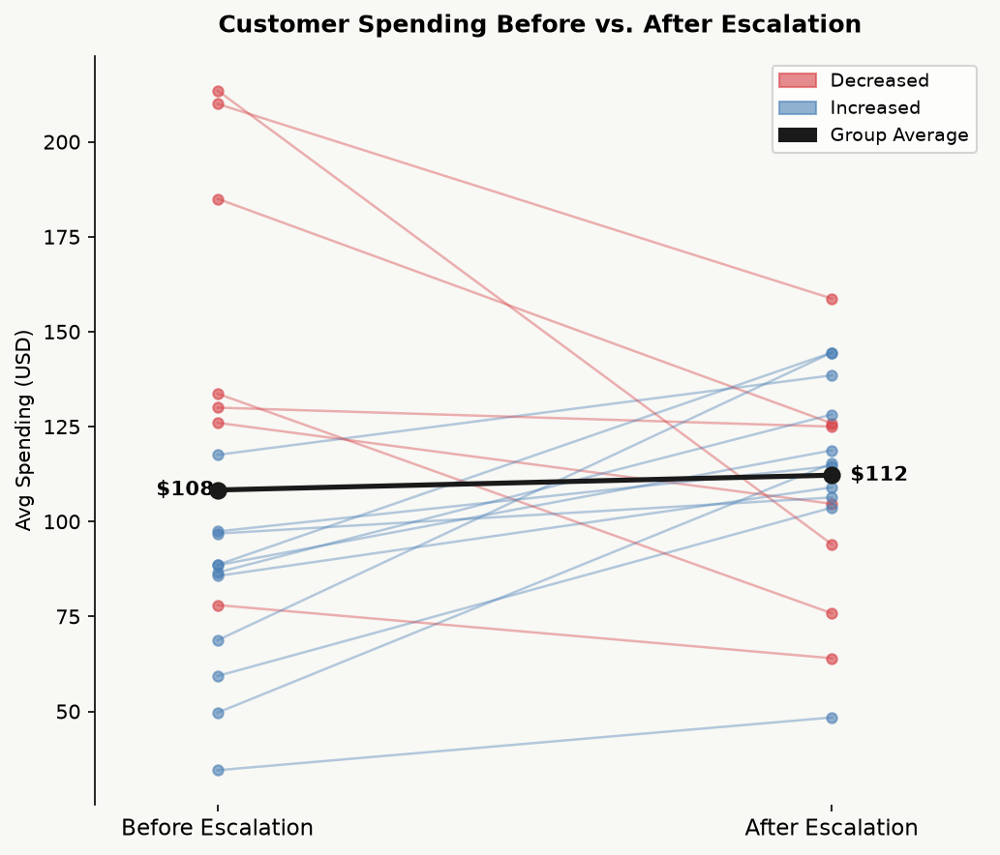
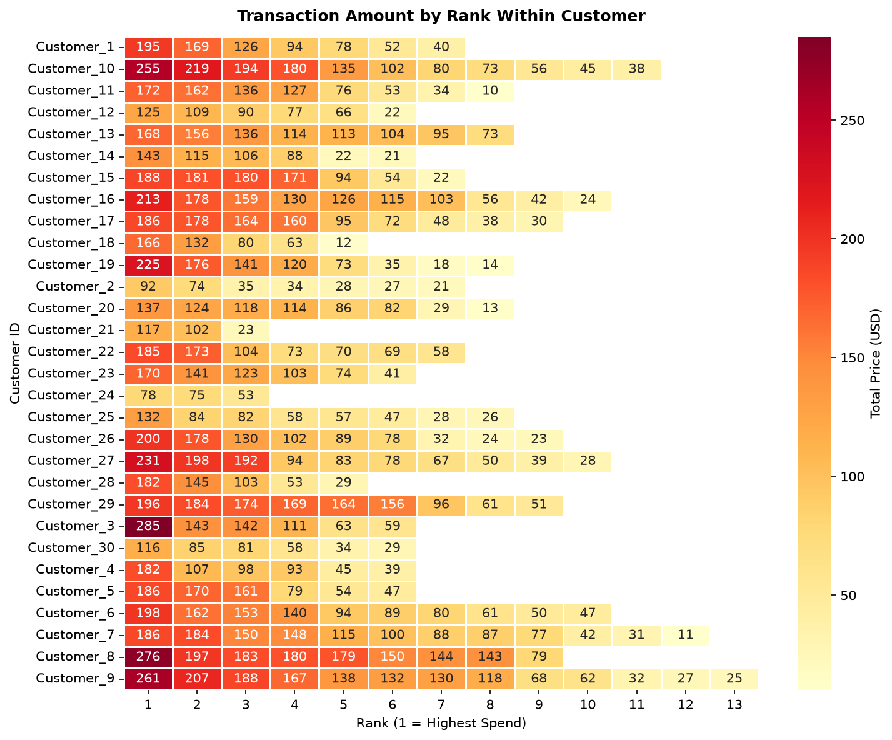
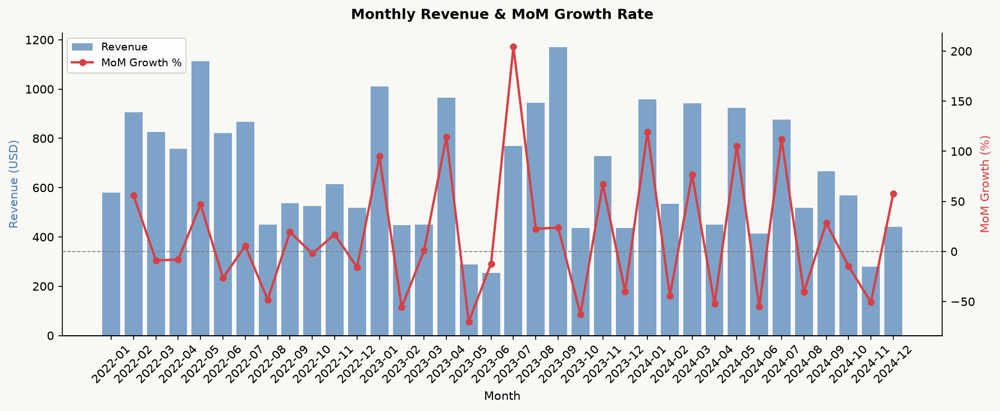

# Retail Customer Analytics with SQL

An end-to-end SQL analysis of a retail beauty brand's customer data, linking transactions, customer service interactions, marketing touchpoints, and web behavior to answer customer-level business questions. SQL is executed in Python via `pandas.read_sql_query()` on a SQLite database, with results extended through statistical testing and visualization.

## Business Questions

## Business Questions

| Question | Approach | Notebook |
|---|---|---|
| Do customers with heavy customer service usage also spend more? | Multi-table JOIN with pre-aggregated subqueries | [01](notebooks/01_multi_table_joins.ipynb) |
| Does a customer service escalation change a customer's spending? | Balanced panel construction + paired t-test | [01](notebooks/01_multi_table_joins.ipynb) |
| How does each customer engage across all four channels? | Four-table LEFT JOIN on a unified customer list | [01](notebooks/01_multi_table_joins.ipynb) |
| Which traffic source brings the highest-value customers? | First-touch attribution via correlated subquery | [01](notebooks/01_multi_table_joins.ipynb) |
| How does each customer's spending rank across their own transactions? | `ROW_NUMBER()` partitioned by customer | [02](notebooks/02_window_functions.ipynb) |
| Is revenue growing month over month? | Monthly aggregation + `LAG()` | [02](notebooks/02_window_functions.ipynb) |
| Who are the most valuable customers, and who is at risk of churning? | RFM scoring + `NTILE()` decile segmentation | [02](notebooks/02_window_functions.ipynb) |
## Highlight: Escalation Impact Analysis

A naive comparison of customers with and without escalation records conflates two different populations. To isolate the effect of an escalation, this analysis:

1. Identifies each customer's **first escalation date** from customer service records
2. Builds a **balanced panel** — keeping only customers with transactions both before *and* after that date — so the comparison is within the same customers
3. Computes each customer's average spending in the pre- and post-escalation periods
4. Tests the difference with a **paired t-test**

**Result:** No significant change in spending after escalation (n = 18, t = −0.33, p = 0.75). Given the small panel, this indicates insufficient evidence of an effect rather than evidence of no effect.



## Repository Structure

```
Retail-Customer-SQL/
├── data/
│   └── sales_project.db              # SQLite database (4 tables)
├── notebooks/
│   ├── 01_multi_table_joins.ipynb    # JOINs, attribution, escalation analysis
│   └── 02_window_functions.ipynb     # Ranking, MoM growth, RFM, churn risk
└── images/                           # Exported charts
```

## Data

| Table | Rows | Description |
|---|---|---|
| `Transaction_Records` | 228 | Orders: product, price, payment, promotion, loyalty status, completion status |
| `CS_Interaction_Records` | 182 | Customer service contacts: type, outcome, sentiment score, response time |
| `Marketing_Records` | 178 | Marketing touchpoints: platform, post engagement, email response |
| `Web_Interaction_Records` | 100 | Website sessions: traffic source, device, pages visited, duration, bounce |

All tables share `Customer_ID` as the join key.

**Source:** Synthetic retail customer dataset used for SQL practice.

## Visualizations

**Transaction ranking within customers**



**Monthly revenue and month-over-month growth**



## SQL Techniques

- Multi-table `INNER JOIN` / `LEFT JOIN` with aliasing
- Subqueries and correlated subqueries
- Common Table Expressions (`WITH`)
- `EXISTS` for conditional sample filtering
- Conditional aggregation (`AVG(CASE WHEN ...)`)
- Window functions: `ROW_NUMBER()`, `LAG()`, `NTILE()`
- Date handling: `DATE()`, `strftime()`, `JULIANDAY()`

## Tools

SQLite · Python (pandas, SciPy, Matplotlib, seaborn) · Jupyter

## Limitations

- The dataset is small; the balanced panel for the escalation analysis contains a limited number of customers, so statistical power is low.
- The escalation analysis has no control group and cannot rule out time trends or other confounders.
- Traffic source attribution uses each customer's first recorded visit only.
